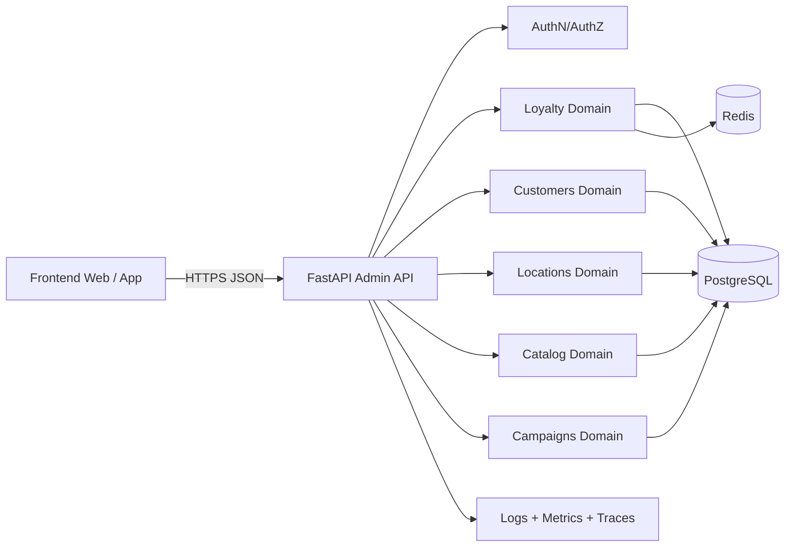

# Borrador de arquitectura backend - Brasaland

## 1) Objetivo del documento
Definir una base arquitectonica compartida para construir el backend de Brasaland sin escribir codigo todavia.

Este documento cubre:
- Patron arquitectonico propuesto y por que encaja con el negocio.
- Organizacion de modulos y dominios.
- Estructura sugerida para proyecto FastAPI con frontend/backend separados.
- Decisiones tecnicas iniciales.
- Riesgos y puntos de posible confusion antes de arrancar el sprint.

## 2) Contexto de negocio que condiciona la arquitectura
Con base en el material actual del proyecto:
- Brasaland opera en dos paises (Colombia y Estados Unidos, Florida).
- Existen 14 ubicaciones y el programa Brasa Points es digital.
- Los usuarios se registran con datos personales, pais, ciudad, ubicacion favorita, fuente de adquisicion y aceptacion de terminos.
- El beneficio principal gira alrededor de acumulacion y canje de puntos.
- Aun no hay pedidos online, pero es una capacidad esperable en siguientes hitos.

Implicacion: el backend debe priorizar consistencia de reglas de lealtad, trazabilidad de movimientos de puntos, soporte multi-pais y crecimiento incremental.

## 3) Patron arquitectonico propuesto
## Propuesta principal
Monolito modular con arquitectura por dominios (estilo DDD tactico + capas limpias/hexagonales dentro de cada modulo).

Decision:
- Un solo despliegue de API inicialmente.
- Limites de dominio claros desde el dia 1.
- Dependencias internas solo a traves de casos de uso y contratos.

Por que encaja ahora:
- El equipo necesita velocidad y claridad, no complejidad operacional temprana.
- Las reglas de lealtad y clientes comparten transacciones y validaciones.
- Permite extraer microservicios mas adelante sin rehacer todo.

Alternativas consideradas:
1. Microservicios desde el inicio:
   - Ventaja: aislamiento fuerte por dominio.
   - Costo actual: mayor complejidad de despliegue, observabilidad, contratos y consistencia distribuida.
   - Veredicto: prematuro para el estado actual.
2. Monolito por capas tecnicas (controllers/services/repositories globales):
   - Ventaja: rapido de arrancar.
   - Riesgo: acoplamiento por tecnologia y crecimiento desordenado.
   - Veredicto: no recomendado.

## 4) Vista de alto nivel


## 5) Estructura recomendada para FastAPI
Ubicacion sugerida inicial:
- services/admin-api

Estructura:

```text
services/
  admin-api/
    app/
      main.py
      api/
        v1/
          router.py
          dependencies.py
          endpoints/
            health.py
            auth.py
            customers.py
            loyalty.py
            locations.py
            catalog.py
            campaigns.py
      core/
        config.py
        security.py
        logging.py
        errors.py
      modules/
        customers/
          domain/
          application/
          infrastructure/
          interfaces/
        loyalty/
          domain/
          application/
          infrastructure/
          interfaces/
        locations/
          domain/
          application/
          infrastructure/
          interfaces/
        catalog/
          domain/
          application/
          infrastructure/
          interfaces/
        campaigns/
          domain/
          application/
          infrastructure/
          interfaces/
      db/
        base.py
        session.py
        migrations/
      tests/
        unit/
        integration/
    pyproject.toml
    README.md
```

Convenciones clave:
- api: solo transporte HTTP (request/response, validacion superficial, codigos de estado).
- application: casos de uso y orquestacion.
- domain: entidades, reglas e invariantes de negocio.
- infrastructure: SQLAlchemy, adaptadores externos, persistencia.
- interfaces: contratos de entrada/salida cuando ayude a aislar infraestructura.

## 6) Dominios y modulos funcionales
1. Customers:
- Registro y perfil de cliente.
- Consentimientos (terminos y politicas).
- Preferencias basicas (pais, ciudad, ubicacion favorita, dieta, canal de adquisicion).

2. Loyalty:
- Ledger de puntos (acumulacion, canje, expiracion, ajustes).
- Reglas por pais/moneda para earn rate (COP y USD).
- Historial auditable e inmutable de movimientos.

3. Locations:
- Paises, ciudades, restaurantes, horarios y estado operativo.
- Validaciones para asociar clientes a ubicaciones reales.

4. Catalog:
- Menus y productos elegibles para promociones/canje.
- Reglas de disponibilidad por ubicacion.

5. Campaigns:
- Beneficios, promociones y reglas de elegibilidad.
- Segmentacion simple (por pais, ciudad, actividad o puntos).

Nota: pedidos online no entra como dominio principal del primer sprint backend, pero debe quedar preparado para integrarse luego.

## 7) Organizacion de rutas y versionado
Principios:
- Prefijo comun: /api/v1
- Recursos REST claros.
- Evitar rutas ambiguas por accion; usar subrecursos explicitos cuando el negocio lo requiera.

Ejemplo de agrupacion:
- /api/v1/health
- /api/v1/auth/*
- /api/v1/customers
- /api/v1/customers/{customer_id}
- /api/v1/customers/{customer_id}/consents
- /api/v1/loyalty/accounts/{customer_id}
- /api/v1/loyalty/accounts/{customer_id}/transactions
- /api/v1/locations/countries
- /api/v1/locations/cities
- /api/v1/locations/restaurants
- /api/v1/catalog/menu-items
- /api/v1/campaigns

Regla de evolucion:
- Cambios breaking: nueva version (/api/v2).
- Cambios backward-compatible: mismo /api/v1 con contratos extendidos.

## 8) Frontend y backend separados: contratos y limites
Modelo de integracion recomendado:
- Frontend desacoplado consumiendo API por HTTPS.
- CORS restringido por entornos (dev, staging, prod).
- OpenAPI como contrato fuente para alinear frontend/backend.
- Manejo consistente de errores con estructura comun (code, message, details, request_id).

Ventajas:
- Equipos pueden iterar en paralelo.
- Contratos verificables.
- Facil evolucion a nuevas UIs (app movil, panel interno).

## 9) Decisiones tecnicas iniciales
1. Framework API:
- FastAPI + Pydantic v2.

2. Persistencia:
- PostgreSQL transaccional como sistema principal de registro.
- SQLAlchemy 2.x + Alembic para migraciones.

3. Cache y rendimiento:
- Redis para lecturas frecuentes y locks simples de procesos criticos.

4. Seguridad:
- JWT (access + refresh) para sesiones.
- RBAC basico (admin, operador, cliente) segun necesidad del caso de uso.
- Cifrado en transito (TLS) y minimizacion de datos sensibles en logs.

5. Observabilidad:
- Logging estructurado JSON con request_id.
- Metricas de negocio (puntos emitidos/canjeados, registros por pais).
- Trazas distribuidas preparadas para crecimiento.

6. Calidad:
- Pruebas unitarias de reglas de dominio (prioridad alta en loyalty).
- Pruebas de integracion para endpoints criticos.
- Contratos API validados en CI.

7. Entornos:
- dev, staging, prod con configuracion via variables de entorno.

## 10) Riesgos y puntos de confusion esperables
1. Ambiguedad en reglas de puntos por pais:
- Riesgo: interpretaciones distintas entre producto, negocio y desarrollo.
- Mitigacion: tabla explicita de reglas y ejemplos numericos versionados.

2. Modelo de moneda y conversion:
- Riesgo: mezclar acumulacion en COP y USD sin criterio unico.
- Mitigacion: definir unidad de cuenta de loyalty y politica de conversion.

3. Consentimiento legal y privacidad:
- Riesgo: guardar consentimiento sin version de terminos o timestamp verificable.
- Mitigacion: consent ledger con version legal, fecha y canal.

4. Identidad duplicada de clientes:
- Riesgo: un mismo cliente con multiples cuentas por pais/correo/telefono.
- Mitigacion: reglas de unicidad y proceso de merge controlado.

5. Sobrecarga prematura del dominio Catalog:
- Riesgo: intentar cubrir todo menu/operacion desde el primer sprint.
- Mitigacion: alcance incremental centrado en lo necesario para loyalty.

## 11) Decisiones que deben cerrarse antes del sprint
1. Politica oficial de earn/burn por pais y expiracion de puntos.
2. Reglas de identidad unica de cliente (email, telefono, ambos, o ID externo).
3. Nivel de roles necesario en la primera version.
4. Prioridad de endpoints MVP (registro, consulta de puntos, historial, ubicaciones).
5. Requisitos legales minimos para consentimiento y retencion de datos.

## 12) Plan de implementacion recomendado (MVP backend)
Fase 1:
- Base FastAPI, healthcheck, auth minima, modulo customers y locations.

Fase 2:
- Modulo loyalty con ledger de transacciones y consultas de saldo/historial.

Fase 3:
- Campaigns/canje simple y metricas de negocio.

Fase 4:
- Endurecimiento de seguridad, observabilidad y pruebas de carga.

## 13) Criterio de exito de esta arquitectura
- El equipo entiende donde va cada cambio sin debatir estructura en cada PR.
- Reglas de loyalty viven en dominio, no dispersas en endpoints.
- Frontend y backend trabajan en paralelo con contratos claros.
- El sistema soporta crecimiento a nuevos canales sin rehacer la base.
